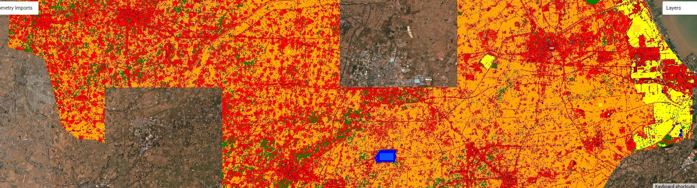
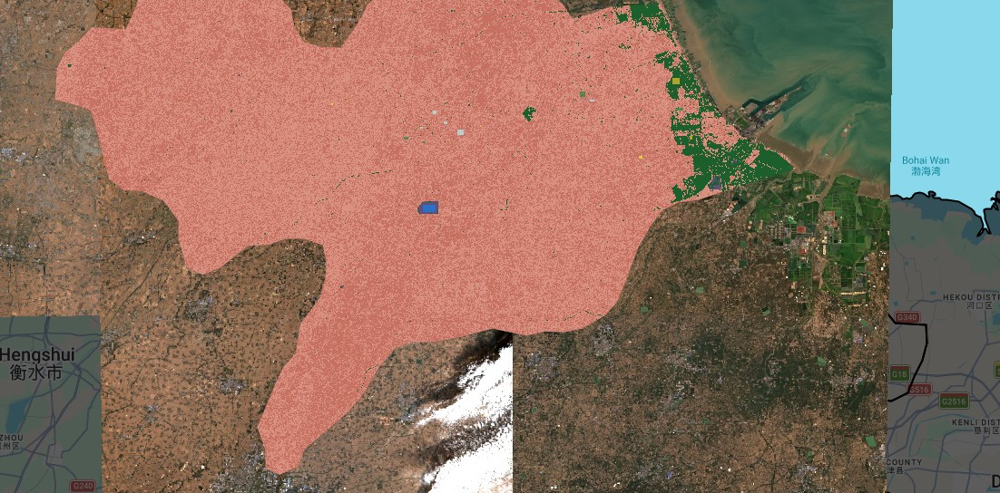

## 1. Summary

This week focused on the transition from pixel-level spectral analysis to **Supervised Image Classification**. The core objective was to transform raw reflectance values from Sentinel-2 into thematic land-cover maps. Following the CASA0023 curriculum [@maclachlan2024], we explored the mechanics of **Decision Trees (CART)** and **Random Forest (RF)** algorithms.

### The Classification Workflow
The process in Google Earth Engine (GEE) follows a linear but iterative pipeline:
1.  **Preprocessing:** Cloud masking using the `QA60` band and median-reducing an ImageCollection to a single composite.
2.  **Training Data:** Manually digitizing geometries to serve as ground-truth "labels."
3.  **Feature Selection:** Choosing spectral bands ($B2, B3, B4, B8, B11, B12$) to serve as independent variables.
4.  **Model Training:** Teaching the classifier to associate spectral "signatures" with land-cover labels.
5.  **Validation:** Assessing the performance via a confusion matrix (not carried out).

## 2. Application: Classifying the Urban-Rural Fringe

In my practical application focused on the Cangzhou region, I encountered significant computational and spectral hurdles that defined my learning process.

### Computational Constraints and Pixel-Level Sampling
Initially, I attempted to sample every pixel within my digitized polygons at a 10m scale. This resulted in over **237,000 training points**, triggering GEE’s "Memory Capacity Exceeded" error. As exercise notes, the GEE browser interface has a limit on the number of elements it can accumulate for display.

To resolve this, I implemented a **stratified random sampling** approach. Instead of using entire polygons, I generated 1,000 random points per class ($n=7,000$ total). This ensured **class balance**—preventing the "Urban" class from overwhelming smaller classes like "Water" in the model's logic.

### Addressing Spectral Confusion
A major challenge was the "Blue Square" phenomenon: a large industrial rooftop in the city center was being consistently misclassified as **Water**. 

*   **The Cause:** Bright concrete and metal can have spectral signatures surprisingly similar to turbid water in visible bands ($B2, B3, B4$). 
*   **The Solution:** I integrated **Short-Wave Infrared (SWIR)** bands ($B11$ and $B12$). Urban materials exhibit high reflectance in the SWIR range compared to the absorption seen in water bodies [@jensen2005introductory]. 

Furthermore, I separated "Agriculture" into two distinct training classes: **Green Crops** and **Bare/Fallow Fields**. While they represent the same land use, their spectral signatures are polar opposites. Training them as separate entities and merging them only at the visualization stage prevented "spectral blurring" in the classifier.

## 3. Reflection: CART vs. Random Forest

The most significant takeaway was the superiority of **Random Forest** over a single **CART** (Classification and Regression Tree). 

A CART model is a single flowchart of decisions. If a bright building looks slightly like a field at the first "branch," the entire pixel is misclassified. In contrast, **Random Forest** is an ensemble method [@breiman2001random]. By building 100 different trees and letting them "vote" on the final class, the model becomes robust against the "noise" of individual pixels.

### Key Technical Lessons:
*   **TileScale:** I learned that "Internal Errors" in GEE are often fixed by increasing the `tileScale` (from 4 to 16), which allows the server to partition complex computations more effectively.
*   **Geometry Simplification:** Hand-drawn polygons with too many vertices can crash the `randomPoints` function. Using `.simplify(1)` is a mandatory step for stable code.

Supervised classification is not a "one-click" process; it is a constant dialogue between the user (who knows the geography) and the algorithm (which knows the math).
---
