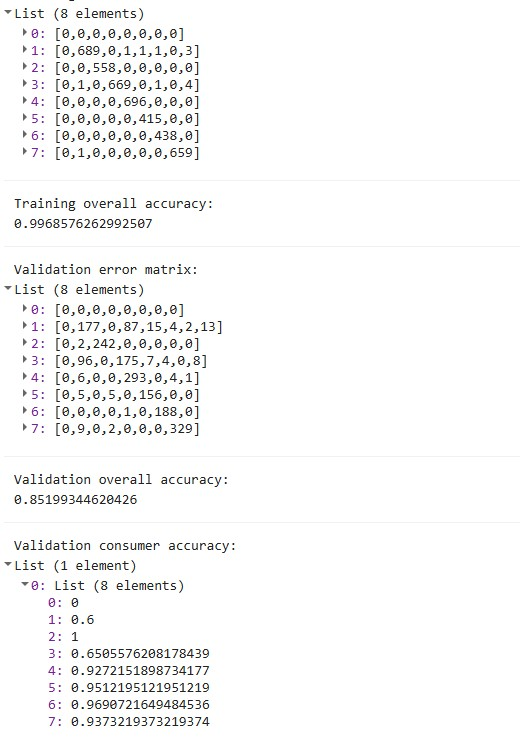
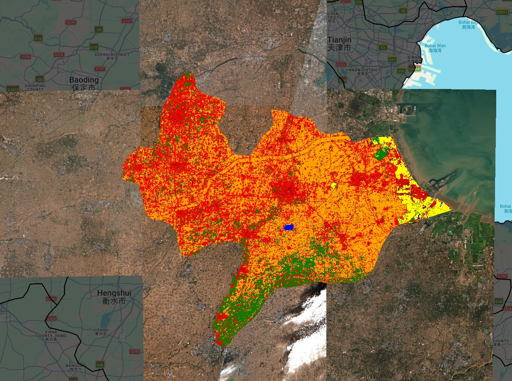

## Summary

This week focused on the transition from pixel-level spectral analysis to supervised image classification. The core objective was to transform raw reflectance values from Sentinel-2 into thematic land-cover maps. We explored the mechanics of Decision Trees (CART) and Random Forest (RF) algorithms in Google Earth Engine.

The classification workflow in GEE follows a pipeline:

- **Preprocessing** — cloud masking using the `QA60` band and median-reducing an ImageCollection to a single composite
- **Training data** — manually digitising geometries to serve as ground-truth labels
- **Feature selection** — choosing spectral bands (B2, B3, B4, B8, B11, B12) as independent variables
- **Model training** — teaching the classifier to associate spectral signatures with land-cover labels
- **Train/test split** — splitting points 70/30 at pixel level to retain independent validation data
- **Validation** — assessing performance via a confusion matrix on unseen data

## Applications

In the practical application focused on the Cangzhou region, two significant challenges defined the learning process.

**Computational constraints:** Initially sampling every pixel within the digitised polygons at 10m scale produced over 237,000 training points, triggering GEE's memory capacity error. The fix was stratified random sampling — generating 1,000 random points per class (7,000 total) to ensure class balance and prevent the urban class from overwhelming smaller classes like water.

```{r fig1, echo=FALSE, fig.cap="Figure 1: Checkered tile failures caused by memory limits when sampling at full resolution.", out.width="80%", fig.align="center"}
knitr::include_graphics("figures/Chekered_tiles_failures.jpg")
```

**Spectral confusion:** A large industrial rooftop in the city centre was consistently misclassified as water. Bright concrete and metal can have spectral signatures similar to turbid water in visible bands (B2, B3, B4). The solution was to add Short-Wave Infrared bands (B11 and B12) — urban materials exhibit high reflectance in SWIR compared to the strong absorption seen in water bodies [@jensenIntroductoryDigitalImage2016]. Additionally, agriculture was split into two training classes — green crops and bare/fallow fields — since their spectral signatures are opposite despite representing the same land use.Cangzhou region at the time of study had lots of bare fields which made it challenging to find a suitable class initially. 

## Reflection

The most significant takeaway was the difference between CART and Random Forest. A CART model is a single decision tree — if a bright building looks slightly like a field at the first branch, the entire pixel is misclassified. Random Forest is an ensemble method [@breimanRandomForests2001] that builds multiple trees and lets them vote on the final class, making it robust against spectral noise from individual pixels.

```{r fig2, echo=FALSE, fig.cap="Figure 2: CART classification showing over-generalisation across the scene.", out.width="80%", fig.align="center"}
knitr::include_graphics("figures/Classification1_over_genreralised.jpg")
```

The final Random Forest classification used a 70/30 pixel-level train/test split — 4,857 points for training and 2,143 for validation — with 4,137 points ultimately used after removing those falling outside the Cangzhou boundary. The training overall accuracy was **99.7%**, while the validation overall accuracy was **85.2%**. The gap between these two figures indicates some overfitting — the model learned the training data very well but generalised less perfectly to unseen pixels. This is a known limitation of Random Forest when training polygons are small or spectrally similar classes are adjacent [@breimanRandomForests2001].

```{r fig3, echo=FALSE, fig.cap="Figure 3: Training and validation error matrices with consumer accuracy per class.", out.width="80%", fig.align="center"}

```

```{r fig4, echo=FALSE, fig.cap="Figure 4: Final Random Forest land cover classification of Cangzhou, 2022.", out.width="80%", fig.align="center"}

```

Looking at the consumer accuracy per class, water achieved 1.0 (100%), grass 0.93, bare earth 0.97 and agriculture 0.97 — suggesting the model performs well for spectrally distinct classes. Urban low (0.60) showed the weakest performance, likely because low-density urban areas in Cangzhou share spectral characteristics with bare earth, particularly in an agricultural region where small settlements are interspersed with fields.

Two technical lessons stood out. First, internal errors in GEE are often fixed by increasing `tileScale` (from 4 to 16), which allows the server to partition complex computations more effectively. Second, hand-drawn polygons with too many vertices can crash the `randomPoints` function — using `.simplify(1)` is a necessary step for stable code.

Supervised classification is not a one-click process — it is a constant dialogue between the user who knows the geography and the algorithm that knows the mathematics.(Google, n.d.)

## References
Google (n.d.) Supervised Classification. Available at: google.com (Accessed: [17/03/2026]).