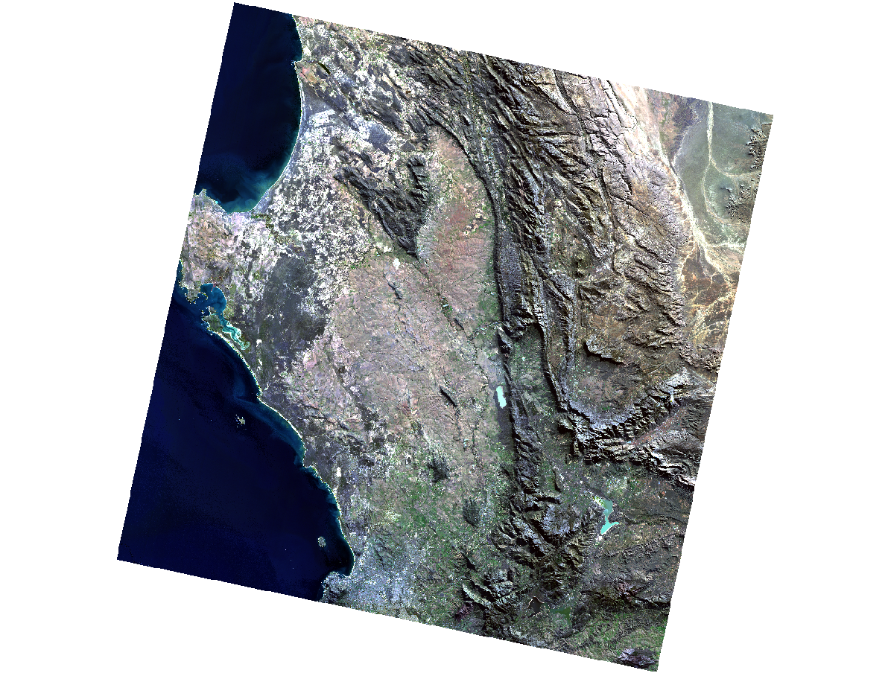
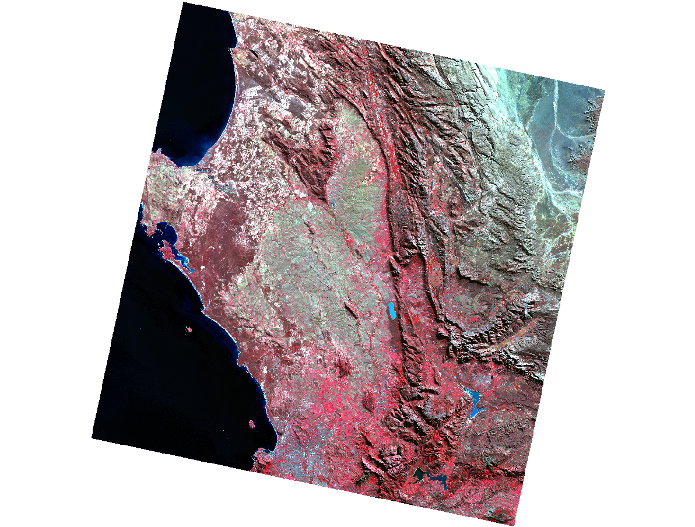
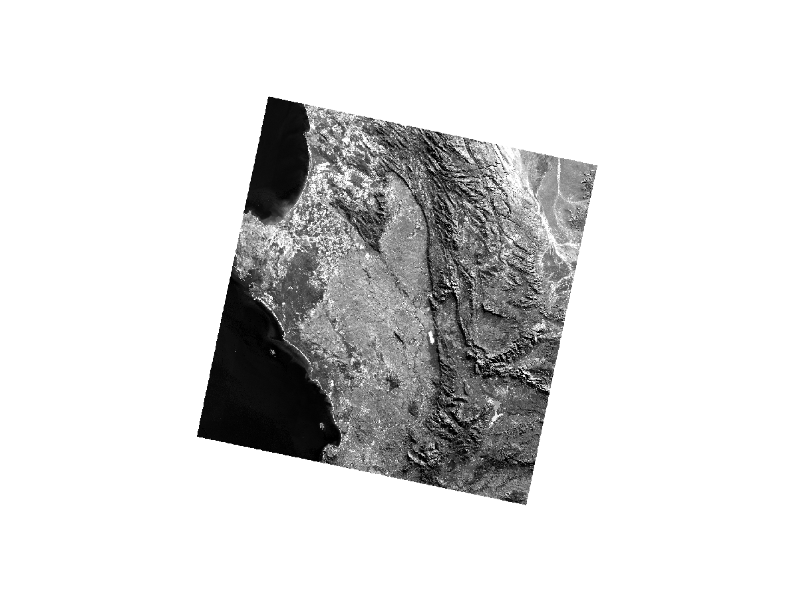

## Summary

This week introduced satellite remote sensing through Sentinel-2 and Landsat 8/9 data, explored in SNAP and QGIS over Cape Town, South Africa. The practical covered loading multi-spectral imagery, creating colour composites, resampling to a common resolution, masking to a study area boundary, and computing the Tasseled Cap transformation. Figures 1–3 show outputs from the Landsat 9 scene; the true colour composite (B4-B3-B2) renders the scene as the eye would see it, with the Atlantic to the west, the Cape Fold Mountains running north-south, and the Cape Flats urban area to the centre-left. The false colour composite (B5-B4-B3) reassigns NIR to the red gun, making actively photosynthesising vegetation unambiguous — areas visually similar in true colour become immediately distinguishable. Band 3 alone (Figure 3) illustrates that a composite is simply three independent greyscale rasters assigned to colour guns; there is no inherent colour in the data.

```{r fig1, echo=FALSE, fig.cap="Figure 1: Landsat 9 true colour composite (B4-B3-B2), Cape Town, June 2022. Source: USGS.", out.width="75%", fig.align="center"}

```

```{r fig2, echo=FALSE, fig.cap="Figure 2: False colour composite (B5-B4-B3). Red tones indicate active vegetation; urban areas appear grey-blue. Source: USGS.", out.width="75%", fig.align="center"}

```

```{r fig3, echo=FALSE, fig.cap="Figure 3: Band 3 (red) as a single greyscale layer — each spectral band is an independent reflectance raster. Source: USGS.", out.width="75%", fig.align="center"}

```

Figures 4–6 show the Tasseled Cap feature space computed in SNAP. The Greenness vs Brightness plot (Figure 4) shows the characteristic wedge — a soil line extending toward higher brightness with a separate arm of vegetated pixels. Brightness vs Wetness (Figure 5) shows most pixels at negative wetness values, consistent with the dry impervious and rocky surfaces dominant in this winter scene. The Greenness vs Wetness plot (Figure 6) is more diffuse, reflecting sparse, seasonally dry vegetation cover. Together they demonstrate the transformation's core value: compressing six raw bands into three physically interpretable dimensions — soil, vegetation and moisture — that @jensenIntroductoryDigitalImage2016 [p.23] describes as capturing the majority of meaningful spectral variance within a scene.

```{r fig456, echo=FALSE, out.width="32%", fig.show="hold", fig.cap="Figures 4–6: Tasseled Cap scatterplots — Greenness vs Brightness; Brightness vs Wetness; Greenness vs Wetness. Cape Town Landsat 9 scene, June 2022."}
knitr::include_graphics(c(
  "figures/Greeness vs brightness scatterplot.png",
  "figures/Brightness vs wetness scatterplot.png",
  "figures/Greenness vs Wetness Scatterplot.png"
))
```

A key limitation of Landsat is its 30m spatial resolution — sufficient for regional analysis but coarse for dense urban environments where a single pixel commonly mixes road, rooftop, vegetation and shadow. Sentinel-2 partially addresses this with 10m visible and NIR bands, but lacks a thermal infrared band entirely, making Landsat the only free option for land surface temperature retrieval. A broader limitation shared by both is their passive nature — cloud cover and darkness render optical imagery unusable precisely when monitoring is most needed. Active SAR sensors overcome this constraint, suggesting that future analytical workflows will increasingly combine optical and SAR data rather than relying on either in isolation.

## Applications

The Tasseled Cap transformation, originally developed by @cristTMTasseledCap1985 for Landsat Thematic Mapper data, established the principle that multi-spectral imagery could be rotated into a physically meaningful feature space rather than analysed band by band. The result is three interpretable dimensions — brightness, greenness and wetness — that directly correspond to physical surface properties rather than raw reflectance values in individual bands.

Building on this idea, a wide range of spectral indices have since been developed that exploit the contrast between specific bands to isolate particular land cover types. NDVI uses NIR and red bands to separate vegetation from other surfaces; NDWI uses green and NIR to detect water; NDBI uses SWIR and NIR to map impervious urban surfaces. The common principle across all of them is that domain knowledge about how different materials reflect electromagnetic radiation can be encoded into simple band ratios — making them computationally cheap, physically grounded and transferable across sensors.

For urban applications specifically, the challenge is that 30m pixels commonly mix multiple surface types — road, rooftop, vegetation and shadow can all coexist within a single Landsat pixel. This limits how much a spectral index alone can tell us about a dense city environment. As @jensenIntroductoryDigitalImage2016 [pp.1–18] notes, the fundamental challenge in remote sensing is extracting thematic information from radiometric measurements — and the practical this week illustrated that limitation directly through the Tasseled Cap scatterplots, which characterise the broad spectral structure of the Cape Town scene but cannot resolve the fine-grained land cover patterns that urban analysis often requires.

## Reflections

The most useful outcome of this week was not the software outputs but the underlying framework: that every pixel in a satellite image is a vector of reflectance values in spectral space, and that the structure of that space encodes information about what is on the ground. SNAP as a tool was frustrating — poorly documented at the critical steps and designed for a specialist audience — but the conceptual shift from thinking about images as pictures to thinking about them as spectral data structures is genuinely transferable to any future work involving land cover analysis or change detection.

The broader question this raises is where remote sensing sits relative to other urban data sources. Satellite imagery offers spatial coverage and temporal consistency that no ground-based survey can match, but its thematic resolution remains coarse. As cloud computing platforms like GEE make pre-processed imagery increasingly accessible, the skills that will matter most are arguably not software-specific processing steps but the ability to critically interpret what spectral data can and cannot tell us about the urban environment.
