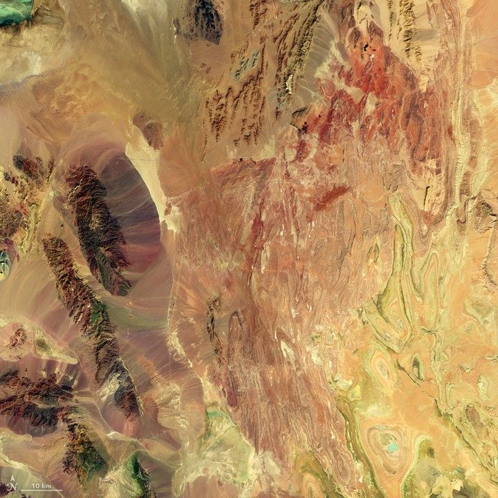
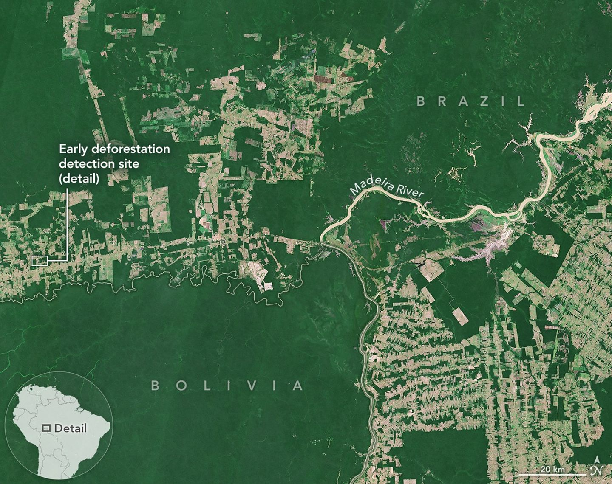

```{r setup, include=FALSE}
options(htmltools.dir.version = FALSE)
```

---
class: inverse, center, middle

# Landsat
### Earth's Longest Earth Observation Record

CASA0023 · UCL CASA · 2026

---
# Summary — What is Landsat?

Landsat is a joint **NASA/USGS** programme providing the longest continuous record of Earth's land surface from space — operating since **1972** (Wulder et al., 2022).

.pull-left[

- 9 satellites launched; **Landsat 8 and 9** currently operational
- Combined **8-day revisit** at the equator
- **30m** optical, **100m** thermal spatial resolution
- Free and open data since **2008**; over **10 million scenes**
- 11 bands including **two thermal infrared (TIRS)** bands — the only free sensor with this capability; Sentinel-2 has no thermal band

]

.pull-right[

```{r, echo=FALSE, out.width="100%", fig.cap="Landsat 8 false colour composite, Iran. Red = vegetation, grey-blue = urban. Source: NASA/USGS (public domain)"}

```

]

---
# Summary — Resolution Trade-offs and Limitations

| Resolution | Landsat 8/9 | Implication |
|-----------|-------------|-------------|
| Spatial | 30m optical / 100m thermal | Mixed pixels in dense urban areas |
| Spectral | 11 bands incl. TIRS | Richer than Sentinel-2; unique thermal capability |
| Temporal | 16 days / 8 days combined | Gaps for time-sensitive monitoring |
| Radiometric | 12-bit (4096 levels) | Collection 2 Level-2 products are analysis-ready |

**Key limitation:** Landsat is a **passive optical sensor** — cloud cover and darkness make imagery unusable during storm events, precisely when monitoring may be most needed. This is why Landsat is increasingly combined with active SAR sensors like Sentinel-1 that are cloud-independent.

---
# Application 1 — Urban Heat Islands

MacLachlan et al. (2021) used Landsat 8 LST time series to map urban heat island (UHI) intensity across multiple cities, demonstrating that impervious surface expansion directly drives surface temperature increases.

Landsat's **thermal infrared band** enables land surface temperature retrieval, while its **archive depth** allows detection of multi-decade warming trends no other free sensor can match.

**Limitation:** Landsat captures daytime LST only (~10:00 local time), missing the nocturnal UHI which is often more intense. MODIS provides day and night acquisitions but at 1km — too coarse for intra-city analysis.

.footnote[MacLachlan et al. (2021) DOI: 10.3389/frsc.2021.715890]

---
# Application 2 — Land Cover Change

.pull-left[
Wulder et al. (2022) highlight that Landsat's 50-year archive enables detection of land change across the full Anthropocene — urban expansion, deforestation, agricultural intensification — at 30m. Sentinel-2 only provides data from 2015, making it insufficient for long-term baselines.

Hansen et al. used annual Landsat composites to produce the first globally consistent map of forest loss at 30m, detecting **2.3 million km²** of forest loss between 2000 and 2012.

Schneider et al. quantified global urban expansion between 1990–2000, finding urban land increased by **58,000 km²** in a single decade — only possible with Landsat's temporal depth.
]

.pull-right[
```{r, echo=FALSE, out.width="85%", out.height="280px", fig.cap="Forest loss, Amazon Basin. Source: NASA Earth Observatory (public domain)."}

```
]
---
# Application 3 — Surface Water Monitoring

Pekel et al. (2016) used the entire Landsat archive (1984–2015) to map global surface water changes, finding **90,000 km²** of permanent water lost globally — equivalent to five Lake Eries. This study would have been impossible without Landsat's temporal depth; no other free sensor covers this period at 30m.

The MNDWI index exploits Landsat's Green and SWIR bands to distinguish water from built-up surfaces:

$$MNDWI = \frac{Green - SWIR}{Green + SWIR}$$

MNDWI suppresses built-up noise better than NDWI, making it preferable in urban contexts. A limitation is that dark surfaces and dry soils can produce similar low SWIR responses to water, requiring careful validation — particularly in arid regions.

.footnote[Pekel et al. (2016) DOI: 10.1038/nature20584]

---
# Reflection

Before preparing this presentation I had not fully appreciated how significant Landsat's archive depth is compared to other free sensors. Sentinel-2 only goes back to 2015, which means many of the most interesting questions about long-term land change simply cannot be answered with it.

The passive sensor limitation is something I understood conceptually from week 1 but feels more concrete now — cloud cover during the exact periods when land change is happening is a real problem, not just a theoretical one.

Going forward, combining Landsat with SAR data seems like the logical direction, and **Landsat Next (~2030)** with improved resolution and more bands will address some of the current spatial limitations. The 50-year archive however is something no future mission can replicate retroactively.

---
# References

MacLachlan, A., Biggs, E., Roberts, G. and Boruff, B. (2021). Sustainable City Planning: A Data-Driven Approach for Mitigating Urban Heat. *Frontiers in Built Environment*, 6. DOI: 10.3389/frsc.2021.715890

Pekel, J.F., Cottam, A., Gorelick, N. and Belward, A.S. (2016). High-resolution global map of surface water and its long-term changes. *Nature*, 540, pp. 418–422. DOI: 10.1038/nature20584

Wulder, M.A. et al. (2022). Fifty years of Landsat science and impacts. *Remote Sensing of Environment*, 280, 113195. DOI: 10.1016/j.rse.2022.113195
