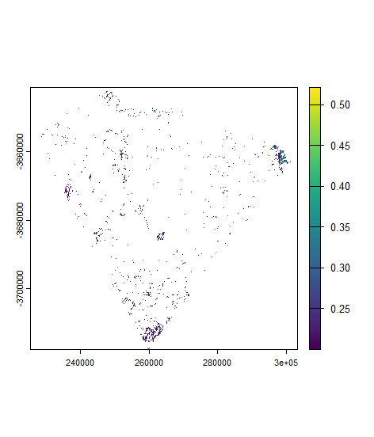
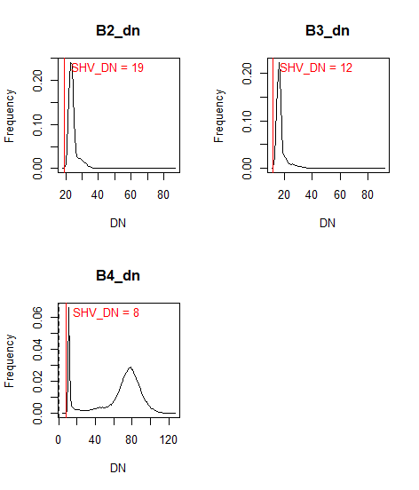
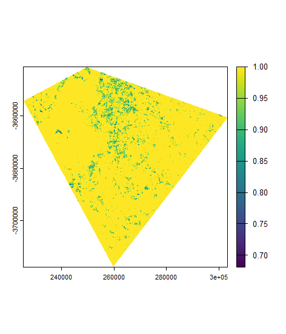
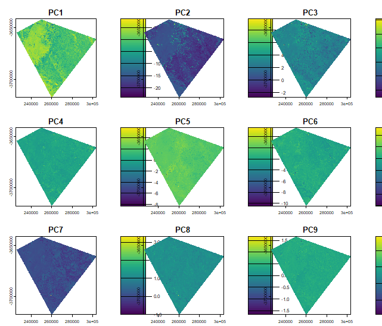

# Summary

This week introduced corrections in remote sensing and why they matter before any quantitative analysis. Satellite imagery is affected by several sources of variation — sensor characteristics, atmospheric scattering and absorption, illumination differences caused by terrain, and geometric misalignment — and corrections aim to reduce these so that pixel values more accurately represent actual surface reflectance.

Radiometric correction converts raw digital numbers (DN) into physical reflectance values. Atmospheric correction removes haze, scattering and absorption caused by gases and aerosols. The practical introduced Dark Object Subtraction (DOS) as an image-based method that assumes the darkest pixel in a scene should have near-zero reflectance, so any residual value can be attributed to atmospheric path radiance and subtracted from the rest of the image. In practice, DOS did not run successfully on the Level 2 data used here — Level 2 products from USGS are already atmospherically corrected surface reflectance, which is why DOS is not applicable. The correction was therefore skipped and the analysis proceeded directly with the Level 2 data.

The practical also covered mosaicking two Landsat tiles (one Landsat 8, one Landsat 9) using `terra::mosaic()` with a mean function to merge overlapping areas, followed by clipping to a custom study area shapefile for Cape Town. Subsequent enhancements included a 3×3 focal mean filter on Band 4, GLCM texture analysis (homogeneity, 7×7 window) using the `GLCMTextures` package, data fusion combining the spectral bands with the texture layer, and PCA on the combined dataset.

# Practical Outputs

## NDVI

The NDVI image highlights vegetation patterns across the Cape Town study area. Higher values indicate denser or healthier vegetation, while lower values correspond to bare soil, built-up areas or water. The reclassified output retains only pixels with NDVI ≥ 0.2, isolating areas with meaningful vegetation cover.

```{r}
#| echo: false

```

## DN Distribution

The DN histograms show the frequency distribution of pixel values across spectral bands. These plots illustrate why radiometric correction is necessary when working with raw data — raw DN values vary by band and are influenced by illumination and sensor characteristics before any correction is applied.

```{r}
#| echo: false

```

## Texture

Texture analysis captures spatial variation in pixel values using the Grey Level Co-occurrence Matrix (GLCM), which characterises the statistical relationship between neighbouring pixels. The homogeneity measure used here reflects how similar adjacent pixel values are — higher values indicate more uniform surfaces. This is useful for differentiating surfaces that may have similar spectral reflectance but different spatial structure, such as urban areas versus scrubland.

```{r}
#| echo: false

```

## Principal Component Analysis (PCA)

PCA reduces the dimensionality of the fused spectral and texture dataset by transforming correlated bands into uncorrelated components. The first component captures the majority of variance and tends to reflect dominant surface brightness patterns, while later components highlight more subtle spectral and textural differences that are not visible in individual bands.

```{r}
#| echo: false

```

# Applications

Corrections are a prerequisite for many remote sensing workflows, not just a preprocessing formality. @jensenIntroductoryDigitalImage2016 [p.208] describes atmospheric correction as essential for any analysis that compares imagery across dates or sensors, since uncorrected images will reflect differences in atmospheric conditions rather than true changes in surface reflectance. This is especially relevant for multi-temporal NDVI analysis — a comparison of vegetation health between two dates will only be meaningful if both images are on the same radiometric scale. The Level 2 surface reflectance products used in this practical handle this automatically, which is one reason they are now the standard for most Landsat-based analysis.

The question of when corrections are actually necessary is more nuanced than it first appears. For a single-date classification where the training data and the image to be classified are from the same scene, atmospheric correction adds little benefit. It becomes essential when data from different dates or different sensors are being combined — exactly the scenario addressed by data fusion. @schultetobuhneBetterTogetherIntegrating2018a showed that fusing multispectral optical data with radar (SAR) imagery improved biodiversity monitoring outcomes compared to either sensor used alone, but noted that this kind of fusion requires the optical data to be atmospherically corrected to ensure the spectral values are physically meaningful before combination. The same principle applies to the spectral-texture fusion performed in this practical: the scale correction applied before the GLCM analysis (`scale <- (m1_clip * 0.0000275) + -0.2`) converts the integer DN values back to surface reflectance, which is a necessary step before any meaningful texture comparison can be made across different areas or dates.

# Reflection

The DOS failure this week was actually clarifying rather than frustrating. Trying to run DOS on a Level 2 product and having it fail made the distinction between Level 1 (digital numbers) and Level 2 (surface reflectance) much more concrete than the lecture description alone. It also raised a question I had not thought about before: if Level 2 products are already corrected, at what point does it make sense to go back and work with raw Level 1 data and apply DOS manually? The answer is probably rarely for standard analysis, but the exercise of understanding what DOS is doing — subtracting the darkest pixel value on the assumption it represents path radiance — helps interpret what the Level 2 correction has already done.

The PCA output was harder to interpret than expected. The first component clearly captured overall brightness, but the later components showed spatial patterns that were difficult to connect back to specific land cover types without more domain knowledge of the area. This feels like a method where the technique is straightforward to apply but much harder to interpret meaningfully — which is a recurring theme in this module so far.

## References

::: {#refs}
:::
