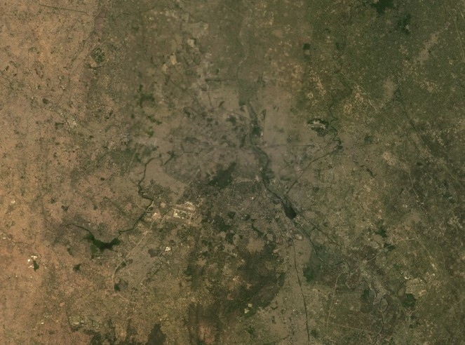
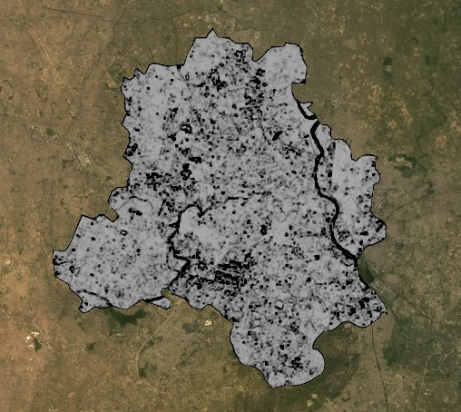
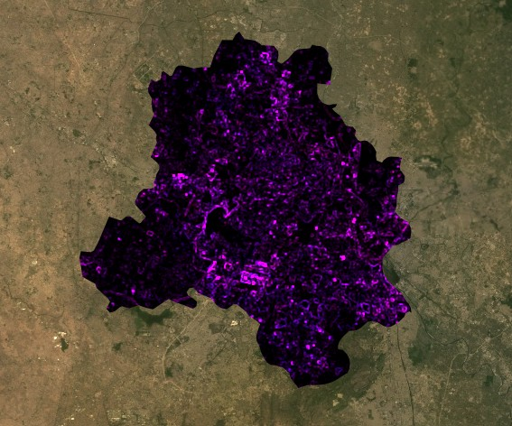
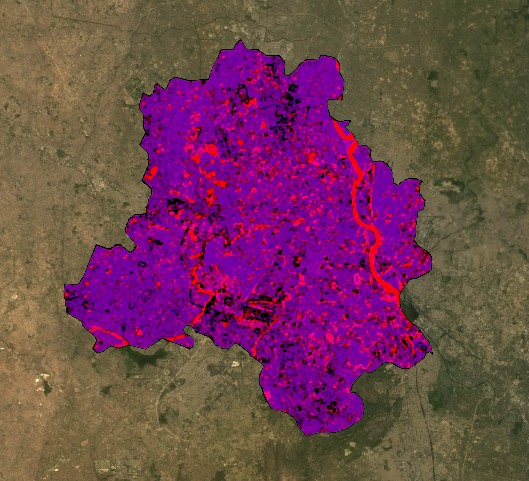

# Summary

This week introduced Google Earth Engine (GEE), which is a cloud-based platform for geospatial analysis. The main difference from what we have been doing in R is that with GEE the data stays on Google's servers and the code is sent there to run — which means we are not limited by our own computer's memory or processing power. This is a big deal for remote sensing because satellite imagery files are enormous and working with them locally in R was already quite slow.

GEE uses JavaScript rather than R, which took some getting used to. The basic syntax is not too different but the way GEE handles data — through image collections, filters and reducers — is quite different from how terra or sf work in R. The practical walked through loading Landsat 9 data for Delhi, filtering by date and cloud cover, applying scaling factors to convert the integer values back to surface reflectance, and creating a median composite to deal with the fact that multiple images cover the same area.

The scaling factor step was something I had encountered in week 3 but it made more sense here — GEE stores Landsat data as integers for efficiency and the factor of 0.0000275 with an offset of -0.2 converts them back to physical reflectance values. The median composite was interesting because it provides a cleaner image than any single scene by effectively removing clouds and other transient features — wherever a pixel is cloudy in one image, the median value from the other images in the collection is used instead.

```{r fig1, echo=FALSE, fig.cap="Figure 1: Landsat 8 median composite true colour (Bands 4-3-2) over Delhi, clipped to the city boundary. Source: USGS Landsat via GEE.", out.width="80%", fig.align="center"}

```

The practical also covered texture analysis and PCA in GEE, which we had done previously in R. In GEE the GLCM texture function requires integer inputs, so the surface reflectance values need to be multiplied by 1000 before applying it. PCA in GEE is considerably more complex than in R — it required writing a custom function rather than just calling `prcomp()` — but the underlying principle is the same.

```{r fig2, echo=FALSE, fig.cap="Figure 2: First principal component (PC1) over Delhi. Light tones indicate high variance areas — predominantly the dense urban core. Source: USGS Landsat via GEE.", out.width="80%", fig.align="center"}

```

# Applications

@gorelickGoogleEarthEngine2017 describe GEE as enabling planetary-scale geospatial analysis that would previously have required access to supercomputing infrastructure. The key innovation is not the algorithms themselves — most of what GEE can do could in principle be done in R or Python — but the fact that the data is co-located with the computing resources, removing the bottleneck of downloading and storing large datasets locally. For a student working on a laptop this difference is immediately obvious: filtering and compositing a year of Landsat data over Delhi took seconds in GEE, whereas the equivalent operation in R in week 3 took several minutes on two tiles.

```{r fig3, echo=FALSE, fig.cap="Figure 3: GLCM texture (contrast and dissimilarity) over Delhi. The magenta tones highlight areas of high textural variation — predominantly the dense and heterogeneous urban core. Source: USGS Landsat via GEE.", out.width="80%", fig.align="center"}

```

@amaniGoogleEarthEngine2020 review over 500 GEE applications and find that land use and land cover change, vegetation monitoring and urban analysis are the three most common application domains. For urban remote sensing specifically, GEE's temporal depth — the full Landsat archive back to 1984 — combined with cloud-based processing makes it practical to run analyses that would be computationally prohibitive locally. The ability to compute a cloud-free median composite over an entire year rather than relying on a single scene is a direct example of this.

```{r fig4, echo=FALSE, fig.cap="Figure 4: PCA bands 1 and 2 combined over Delhi. The purple and red tones represent different combinations of the two dominant components of spectral variance. Source: USGS Landsat via GEE.", out.width="80%", fig.align="center"}

```

# Reflection

The shift from R to JavaScript felt quite abrupt this week. In R I have at least some familiarity with the syntax from previous modules, but JavaScript in GEE has its own logic — particularly the way functions are defined and called, and the way the map and console interact with the code. I found myself spending more time debugging syntax errors than actually thinking about the remote sensing concepts, which was frustrating.

That said, the speed difference between GEE and R is genuinely impressive. Running texture and PCA on a clipped Landsat image in GEE was near-instant compared to the same operations in week 3 which took several minutes. I can see why GEE has become the standard tool for large-scale remote sensing analysis. The practical only scratched the surface of what it can do — the data catalogue alone has hundreds of datasets I had not heard of before, and the ability to build interactive applications from GEE code is something I would like to explore further.

## References

::: {#refs}
:::
