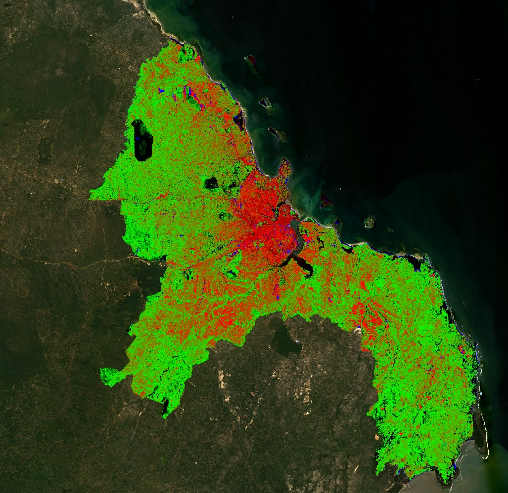
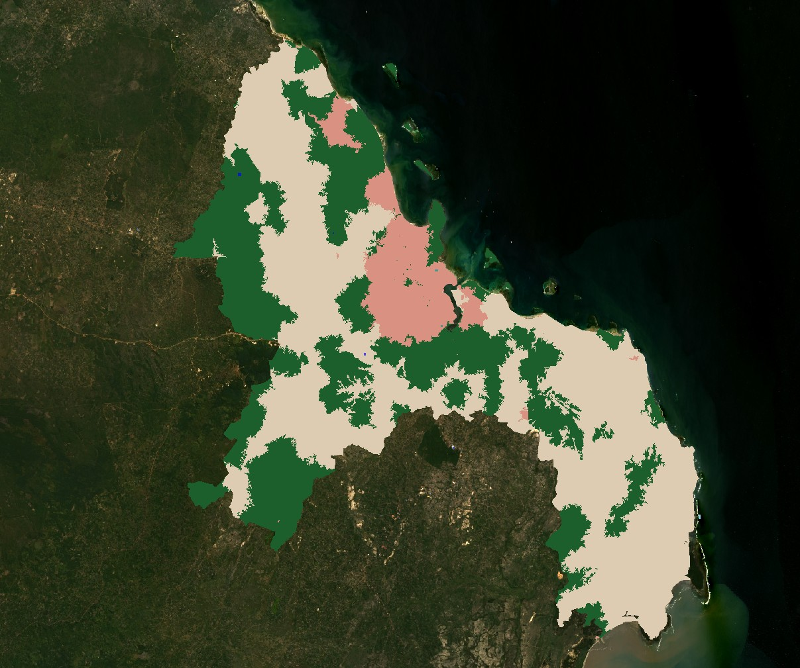
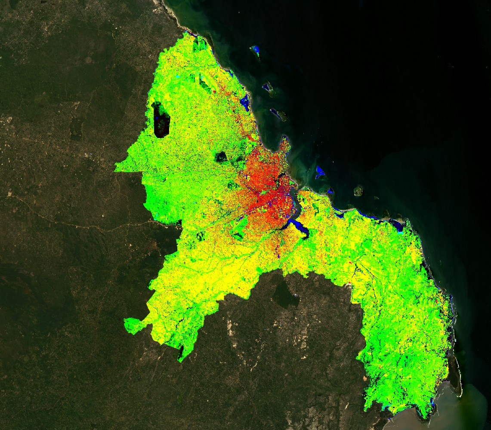

## Summary

This week extended the classification work from week 6 by introducing sub-pixel classification, object-based image analysis (OBIA) using superpixels, and accuracy assessment. The study area was Dar es Salaam, Tanzania, using Landsat 8 Collection 2 imagery in GEE.

The key conceptual shift from week 6 is that pixel-based classification treats every 30m cell as belonging entirely to one land cover class. In reality most pixels contain a mix of surface types — a single Landsat pixel in Dar es Salaam might contain road, rooftop, tree canopy and soil simultaneously. Sub-pixel classification addresses this by estimating the fraction of each land cover type within every pixel rather than forcing a single class label @foodySubPixelMethodsRemote2004.

The practical covered three approaches. First, spectral unmixing — defining endmembers for urban, grass, bare earth and forest by drawing polygons on the map and extracting mean spectral values, then using GEE's `unmix()` function to compute the fraction of each endmember per pixel. Second, OBIA using SNIC superpixels — grouping pixels into objects based on spectral similarity before classifying at the object level. Third, hardening — converting continuous fraction outputs into a discrete classification by assigning each pixel to whichever class exceeded a 0.5 threshold.

## Applications

```{r fig1, echo=FALSE, fig.cap="Figure 1: Constrained spectral fractions over Dar es Salaam. Red tones indicate high urban fraction concentrated in the city centre; green tones indicate vegetation dominant in peri-urban areas; blue pixels near the coast indicate water fraction.", out.width="80%", fig.align="center"}

```

Looking at the constrained fractions output (Figure 1), the urban signal — shown in red — is strongly concentrated in the central coastal area of Dar es Salaam which matches the known location of the CBD and densely built-up neighbourhoods. Green vegetation dominates the peri-urban areas to the west and south, which is consistent with the lower density residential and agricultural land that surrounds the city core. The blue pixels along the coast and harbour correctly identify water bodies even though no water class was explicitly defined — the unmixing algorithm detected the spectral dissimilarity from all four endmembers and expressed it as a residual, which in this case corresponds visually to the Indian Ocean.

```{r fig2, echo=FALSE, fig.cap="Figure 2: Hardened classification of Dar es Salaam applying a 0.5 fraction threshold. Pink areas show urban land cover; green shows forest/vegetation; cream areas are unclassified pixels where no single endmember exceeded 50%.", out.width="80%", fig.align="center"}

```

The hardened output (Figure 2) shows a limitation of the 0.5 threshold approach — a large proportion of the city appears as unclassified cream/white. This happens because Dar es Salaam has a large informal settlement zone where urban, vegetation and bare earth are deeply intermixed at scales below the 30m pixel. No single endmember dominates above 50% in these areas, so the pixel remains unassigned. This is precisely the problem @foodySubPixelMethodsRemote2004 identifies with sub-pixel analysis — the accuracy is difficult to assess and the output is sensitive to the quality and representativeness of the endmembers chosen.

```{r fig3, echo=FALSE, fig.cap="Figure 3: Unmixed (unconstrained) fractions showing the full spectral decomposition before constraining values to sum to one.", out.width="80%", fig.align="center"}

```

## Reflection

The most useful thing this week was seeing the difference between the constrained and unconstrained unmixing outputs side by side. The unconstrained version (Figure 3) has more vivid colour variation because fraction values are not forced to sum to one — pixels can have values above 1 or below 0 which does not make physical sense but shows where the endmembers are a poor fit for the actual surface. Where the constrained and unconstrained outputs differ most strongly is likely where the training polygons were least representative.

The OBIA approach using SNIC superpixels felt more intuitive for an urban environment — grouping spectrally similar pixels into objects before classifying them is closer to how a human would interpret the image. The challenge is that it introduces more parameters to tune, and getting the compactness and neighbourhood size right for a heterogeneous city like Dar es Salaam requires iteration that the practical did not cover in depth.

What struck me more on reflection is that both approaches — sub-pixel and OBIA — are trying to solve the same underlying problem: the mismatch between the spatial resolution of the sensor and the complexity of what is actually on the ground. A 30m Landsat pixel is simply too coarse for a city like Dar es Salaam where informal settlements create highly fragmented land cover patterns at scales of a few metres. This is not a problem that better algorithms alone can fix — it is fundamentally a data resolution issue. Higher resolution sensors like Sentinel-2 at 10m or commercial sensors at sub-metre resolution would reduce but not eliminate this fragmentation problem @foodySubPixelMethodsRemote2004.

The choice of endmembers also felt somewhat arbitrary — I drew polygons that looked representative on screen, but there is no guarantee they captured the full spectral variability of each class across the whole city. A more rigorous approach would derive endmembers statistically from the image itself rather than from manually drawn samples, which would reduce the subjectivity embedded in the classification.